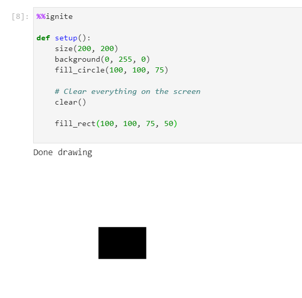

*Below is a list of all of the information about colors within spark.*

All of the examples below assume you have the boilerplate from [the notebook setup](../#boilerplate) in your code

## Creating a background

There are two ways to use background:

| Method                       | Description                       | Syntax                |
| ---------------------------- | ----------------------------------|-----------------------|
|[String](#string-background)  | Give the name i.e. "green"        | background("Green")   |
|[3 ints](#integer-background) | Give the r,g,b vaule i.e. 0,255,0 | background(0, 255, 0) |

### String background
```python
background(color)
```

**Parameters**

- color: (str) The name of the color to use

Example(s):

*Creating a green background*


```python hl_lines="7"
%%ignite

def setup():
    size(200, 200)

def draw():
    background("Green")
```

Results in:

.png)

### Integer background
```python
background(r, g, b)
```

**Parameters**

- r: (int) The red value (between 0-255)
- g: (int) The green value (between 0-255)
- b: (int) The blue value (between 0-255)

Example(s):

*Creating a green background*


```python hl_lines="7"
%%ignite

def setup():
    size(200, 200)

def draw():
    background(0, 255, 0)
```

Results in:

.png)


### Clearing the screen

To clear the screen, there are two options:

| Method                                | Description                                                                             |
| --------------------------------------| ----------------------------------------------------------------------------------------|
|[clear()](#clear)                      | Clear the screen to default background color (light or dark depending on user settings) |
|[background()](#creating-a-background) | Clear the screen with a specific color                                                  |

#### Notes

- For both make sure to put it at the top or bottom of your draw() function if you are using one
- For the r, g, b values they go from 0-255. So for all green you would use 0, 255, 0

#### clear()

clear explicitly just clears the screen to the default background color

```python
clear()
```

Example(s):

*Drawing a green background and a circle, then clearing the screen and drawing just a rectangle*


```python hl_lines="11"
%%ignite

def setup():
    size(200, 200)

    # Draw stuff before clear
    background(0, 255, 0)
    fill_circle(100, 100, 75)

    # Clear everything on the screen
    clear()

    # Only this stuff shows up
    fill_rect(100, 100, 75, 50)

```

Results in:



### Changing the color of shapes

There are two available options to change the color of shapes you draw:

| Method                    | Description                       | Syntax                |
| ------------------------- | ----------------------------------|-----------------------|
|[String](#string-version)  | Give the name i.e. "green"        | fill_style("Green")   |
|[3 ints](#integer-version) | Give the r,g,b vaule i.e. 0,255,0 | fill_style(0, 255, 0) |

#### Notes

- Keep in mind you need to select the color **then** draw the shape. Like dipping a paintbrush before drawing.
- For the r, g, b values they go from 0-255. So for all green you would use 0, 255, 0


#### String version
```python
fill_style(color)
```

**Parameters**

- color: (str) The name of a color ([full list found here](https://www.w3schools.com/colors/colors_names.asp)) i.e. "blue"

Example(s):

*Drawing a red, a green, and a blue circle at different points on the canvas*

```python hl_lines="7 11 15"
%%ignite 

def setup():
    size(200, 200)

    # Red Circle
    fill_style("red")
    fill_circle(50, 50, 50)

    # Green Circle
    fill_style("green")
    fill_circle(100, 100, 50)

    # Blue Circle
    fill_style("blue")
    fill_circle(150, 150, 50)
```

Results in:

.png)

#### Integer version
```python
fill_style(r, g, b)
```

**Parameters**

- r: (int) The red value (between 0-255)
- g: (int) The green value (between 0-255)
- b: (int) The blue value (between 0-255)

Example(s):

*Drawing a red, a green, and a blue circle at different points on the canvas*

```python hl_lines="7 11 15"
%%ignite

def setup():
    size(200, 200)

    # Red circle
    fill_style(255, 0, 0)
    fill_circle(50, 50, 50)

    # Green Circle
    fill_style(0, 255, 0)
    fill_circle(100, 100, 50)

    # Blue circle
    fill_style(0, 0, 255)
    fill_circle(150, 150, 50)
```

Results in:

.png)