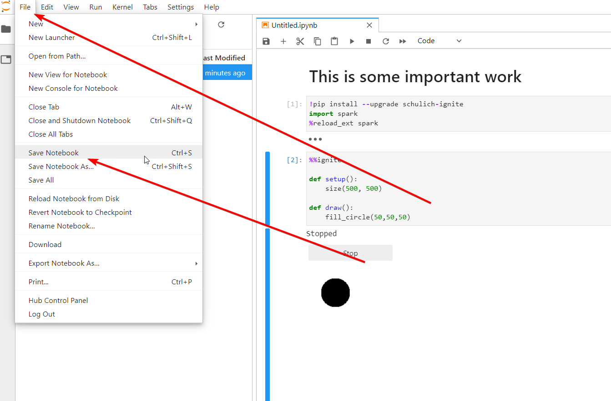

Welcome to the documentation for spark. Spark is a library developed by [Schulich Ignite](https://schulichignite.com) to help students draw in python.

## The basics

Below is everything you need to get started with spark. If you are looking for something specific there is a search bar in the top right and a list of available documentation on the left, and at the bottom of this page. 

Also note that you can copy any code listed on this site by clicking on the clipboard icon in the top right of the code block.

#### Logging in and Slides

To use spark simply login to the Schulich Ignite server [here](https://ignite.aranite.com/), you will need a gmail account (an email with @gmail.com).

Slides for each class are available on [the main website](https://schulichignite.com/#sessions-slides).

### Interface

Please keep in mind the Schulich Ignite server is based on [Jupyter Notebooks](https://jupyter.org/), and may look different to other versions of python you have seen.

#### Toolbars

There are two toolbars


##### Toolbar 1

Primarily for creating new notebooks, changing settings, and exporting notebooks

##### Toolbar 2

Used to run cells, and other tasks within the current notebook


###### Play buttons

Also note that there are two "play" options:


The first is to run the current cell (can also be done with shift + enter).

The second runs **all** cells in the notebook

#### Cells

Cells are the little grey rectangles that appear under the second toolbar. You will write your code inside of them. Each cell can be run independently, and notebooks can have an unlimited (mostly) number of cells.


##### Cell numbers

Also keep in mind the number to the left of the text input (grey rectangle) is the cell number, that tells you which cells were last used.

##### Collapsing cells

You can also collapse a cell, or it's output by hitting the blue rectangle on the left of the cell. For example this is what it looks like before:


And what it looks like after hitting the rectangle:


##### Running cells

To run cells you can either click the [play button on toolbar 2](#play-buttons), or hit shift + enter on your keyboard

#### Setting up a notebook 

Once you are logged in you can create a notebook by going to *File --> New --> Notebook*:


You will then need to just hit *Select* on the pre-selected kernal that shows up:


##### Boilerplate

At the start of each notebook you will need to include the following lines in the first cell, and run it before writing any other code:

```python
!pip install --upgrade schulich-ignite
import spark
%reload_ext spark
```

Your notebook should look like this:


Roughly speaking all this code does, is download the latest version of spark and then bring it into the notebook so we can use it.

### Setting up a cell

At the start of each cell (except the first) you need to have at least the following two lines if your code only needs to draw things once:

```python
%%ignite

def setup():
    size(200, 200) # You can change 200, 200 to any integers
```

You can also use the draw() function, which will execute the code constantly that is inside it. This makes it ideal for things like animation, and any code that will update itself over time. **Most of the time this will be the setup you want**:

```python
%%ignite

def setup():
    size(200, 200) # You can change 200, 200 to any integers

def draw():
    # loops everything in here forever and draws stuff
```

## Saving notebooks

There are two options to save. You can save a notebook with a new name, or save an existing notebook:

### Save a notebook with a name

To save your notebook with a new name go to *file --> save as or use ++ctrl++ or ++cmd++ + ++shift+s++:


A few things to keep in mind when saving file:

1. You **CANNOT** have **ANY** spaces, use _ to seperate if need be i.e. ```my_test_notebook.ipynb```
2. Make sure you have ```.ipynb``` at the end, if you don't the file won't load


### Save an existing notebook

To save your notebook with the same name go to *file --> save* or use ++ctrl++ or ++cmd++ + ++s++:


## Other documentation

[Colors](color.md) - Any functions related to coloring shapes, text, or background

[Input](input.md) - Any functions related to taking user input, such as mouse position or keyboard input

[Shapes & Text](shapes_text.md) - Any functions related to creating shapes and/or text

[Utilities](utilities.md) - Any other useful functions that do not fit the above categories
