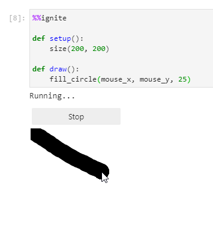
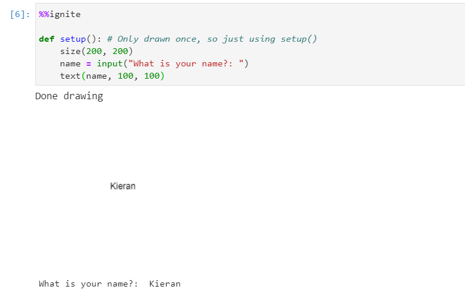
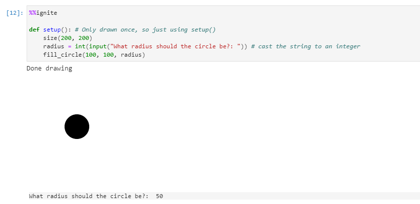
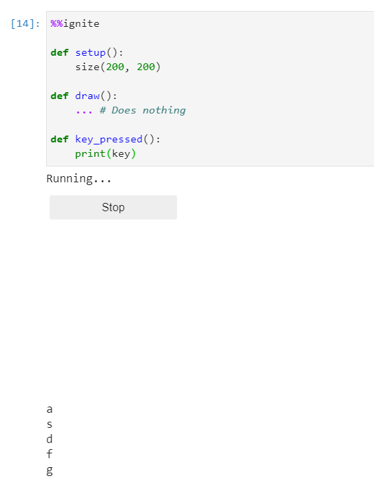
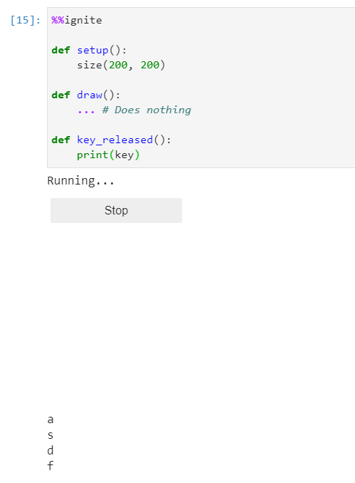
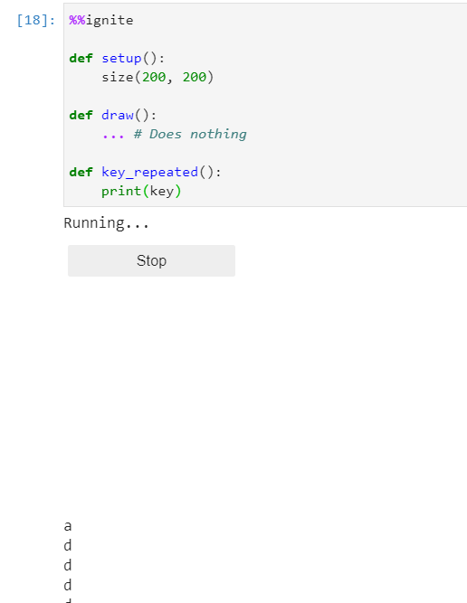

*Below you will find a list of all information necessary to take user input within spark.*

All of the examples below assume you have the boilerplate from [the notebook setup](../#boilerplate) in your code


### Mouse position

To get the current mouse position you can use the following variables:

- mouse_x: (int) The value of the x position of the mouse
- mouse_y: (int) The value of the y position of the mouse


**Example(s):**

*Drawing a circle at the mouse position constantly (remember it will draw over itself over and over again and leave a trail):*

```python hl_lines="7"
%%ignite

def setup():
    size(200, 200)

def draw():
    fill_circle(mouse_x, mouse_y, 25)
```

Results in:

{: loading=lazy }


### Mouse pressed

To find out if the mouse has been pressed you can use the variable:

- mouse_is_pressed: (bool) True if the mouse has been pressed, otherwise False


**Example(s):**

*Rectangle will be red if the mouse has been pressed, otherwise it will be blue*

```python hl_lines="7"
%%ignite

def setup():
    size(200, 200)

def draw():
    if mouse_is_pressed:
        fill_style("red")
    else:
        fill_style("blue")

    fill_rect(mouse_x, mouse_y, 20, 20)
```

Results in:

{: loading=lazy }

### Getting text from user

To ask the user for an answer to a question you can use:

```python
input(message)
```

Keep in mind, whatever the user types in will **always** be a string. See the second example for how to convert to other types.

**Parameters**

- message: (str) The text you want to show the user when asking for input


**Example(s):**

*Ask the user for their name, then display it to the screen:*

```python hl_lines="5"
%%ignite

def setup(): # Only drawn once, so just using setup()
    size(200, 200)
    name = input("What is your name?: ")
    text(name, 100, 100)
```

which results in:

{: loading=lazy }


*Ask the user for a diameter. We need to convert the string to an integer, we can do this using int(). Draw a circle of that diameter at (100, 100):*

```python hl_lines="5"
%%ignite

def setup(): # Only drawn once, so just using setup()
    size(200, 200)
    diameter = int(input("What diameter should the circle be?: ")) # cast the string to an integer
    fill_circle(100, 100 diameter)
```

which results in:

{: loading=lazy }

### Check for key presses

Spark features multiple ways to check for user key presses:

| Name                            | Type                  | Description                                                  |
|---------------------------------|-----------------------|--------------------------------------------------------------|
| [key](#key)                     | Variable              | A string of what key was last pressed                        |
| [keys_held()](#keys_held)       | Function              | A function that returns True if the provided key is held     |
| [key_pressed()](#key_pressed)   | User defined function | A definable function that activates when any key is pressed  | 
| [key_released()](#key_released) | User defined function | A definable function that activates when any key is released |
| [key_repeated()](#key_repeated) | User defined function | A definable function that activates when any key is held     |

#### key

A string that is the last key pressed

##### Notes
- This variable **does not clear**, meaning if a key is pressed it will remain the value until a **new key** is pressed
- This variable will be the uppercase letter if ++shift++ + a letter is pressed i.e. ++shift++ + ++a++ would be `#!python key == "A"`
- This variable will be a symbol if ++shift++ + a number is pressed i.e. ++shift++ + ++3++ would be `#!python key == "$"`


##### Special Keys

| Key           | Value                          |
|---------------|--------------------------------|
| ++up++        | `#!python key == "ArrowUp"`    |
| ++down++      | `#!python key == "ArrowDown"`  |
| ++left++      | `#!python key == "ArrowLeft"`  |
| ++right++     | `#!python key == "ArrowRight"` |
| ++tab++       | `#!python key == "Tab"`        |
| ++ctrl++      | `#!python key == "Control"`    |
| ++alt++       | `#!python key == "Alt"`        |
| ++esc++       | `#!python key == "Escape"`     |
| ++win++       | `#!python key == "Meta"`       |
| ++backspace++ | `#!python key == "Backspace"` |

**Example(s):**

*Print out each key as they are pressed (I pressed **just** the ++a++ key in this example)*


```python hl_lines="8"
%%ignite
def setup():
    size(500,500)

def draw():
    background(255)
    text_size(32)
    text(key, 250, 200)
```

Results in:
{: loading=lazy }

#### keys_held()

```python
keys_held(key)
```

**Parameters**

- key: (str) The key you want to check for

**Returns**

bool; Returns True if the provided key is held, else False.


*Print `#!python "b key held"` if the ++b++ key is held*

```python hl_lines="7"
%%ignite

def setup():
    size(200, 200)

def draw():
    if keys_held("b"):
        print("b key held")
```

Results in:

{: loading=lazy }

#### key_pressed()

```python
def key_pressed():
    # Your code goes here
```

This is a user definable function that activates when **any** key is held.

Example(s):

*Print a key if it's pressed*

```python hl_lines="9 10"
%%ignite

def setup():
    size(200, 200)

def draw():
    ... # Does nothing

def key_pressed():
    print(key)
```

Results in:

{: loading=lazy }

#### key_released()

```python
def key_released():
    # Your code goes here
```

This is a user definable function that activates when **any** key is released.

Example(s):

*Print a key if it's pressed*

```python hl_lines="9 10"
%%ignite

def setup():
    size(200, 200)

def draw():
    ... # Does nothing

def key_released():
    print(key)
```

Results in:

{: loading=lazy }

#### key_repeated()

```python
def key_repeated():
    # Your code goes here
```

This is a user definable function that activates when **any** key is held.

Example(s):

*Print a key if it's held*

```python hl_lines="9 10"
%%ignite

def setup():
    size(200, 200)

def draw():
    ... # Does nothing

def key_repeated():
    print(key)
```

Results in:

{: loading=lazy }
