*Below is a list of all of the shapes, and text available for drawing within spark.*

All of the examples below assume you have the boilerplate from [the notebook setup](../#boilerplate) in your code

### Rectangles

To create a rectangle there are 3 options:

| Function                                | Description                                            |
|-----------------------------------------|-------------------------------------------------------|
| [rect(x, y, w, l)](#rect)               | Draw a rectangle filled with color, and with a stroke |
| [fill_rect(x, y, w, l)](#fill_rect)     | Draw an rectangle filled with a color                 |
| [stroke_rect(x, y, w, l)](#stroke_rect) | Draw the rectangle of an ellipse (it's stroke)        |

<figure>
  
  <figcaption>Comparison of 3 functions, note the red color was added for visibility, by default fill is black</figcaption>
</figure>

#### rect()
```python
rect(x, y, w, l)
```

**Parameters**

- x: (int or float) The value of the x position of the rectangle
- y: (int or float) The value of the y position of the rectangle
- w: (int or float) The width of the rectange
- l: (int or float) The length of the rectange

**Example(s):**

*Creating a filled and stroked rectangle at (100, 100) with a width of 75, and length of 50*

```python hl_lines="7"
%%ignite

def setup():
    size(200, 200)

def draw():
    rect(100, 100, 75, 50)
```

Results in:

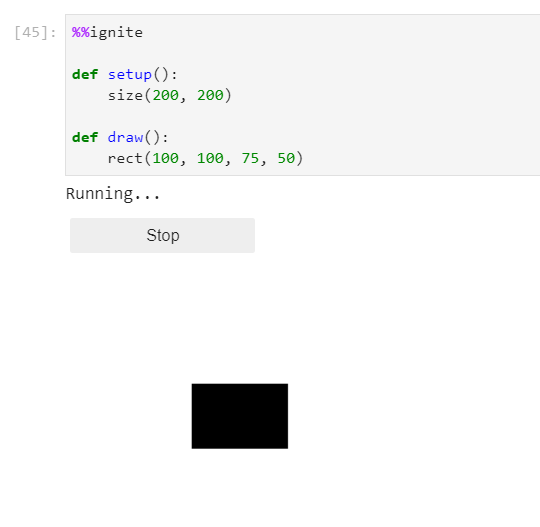

#### fill_rect()
```python
fill_rect(x, y, w, l)
```

**Parameters**

- x: (int or float) The value of the x position of the rectangle
- y: (int or float) The value of the y position of the rectangle
- w: (int or float) The width of the rectange
- l: (int or float) The length of the rectange

**Example(s):**

*Creating a filled rectangle at (100, 100) with a width of 75, and length of 50*

```python hl_lines="7"
%%ignite

def setup():
    size(200, 200)

def draw():
    fill_rect(100, 100, 75, 50)
```

Results in:


#### stroke_rect()
```python
stroke_rect(x, y, w, l)
```

**Parameters**

- x: (int or float) The value of the x position of the rectangle
- y: (int or float) The value of the y position of the rectangle
- w: (int or float) The width of the rectange
- l: (int or float) The length of the rectange

**Example(s):**

*Creating a filled rectangle at (100, 100) with a width of 75, and length of 50*

```python hl_lines="7"
%%ignite

def setup():
    size(200, 200)

def draw():
    stroke_rect(100, 100, 75, 50)
```

Results in:

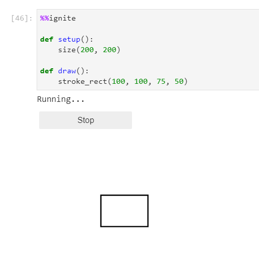

### Circles

To create a circle there are 3 options:

| Function                                  | Description                                        |
|-------------------------------------------|----------------------------------------------------|
| [circle(x, y, d)](#circle)                | Draw a circle filled with color, and with a stroke |
| [fill_circle(x, y, d)](#fill_circle)      | Draw an circle filled with a color                 |
| [stroke_circle(x, y, d)](#stroke_circle) | Draw the circle of an ellipse (it's stroke)        |

<figure>
  
  <figcaption>Comparison of 3 functions, note the red color was added for visibility, by default fill is black</figcaption>
</figure>

#### circle()
```python
circle(x, y, d)
```

**Parameters**

- x: (int or float) The value of the x position of the rectangle
- y: (int or float) The value of the y position of the rectangle
- d: (int or float) The diameter of the circle

Example(s):

*Creating a filled and stroked circle at (100, 100) with a diameter of 75*


```python hl_lines="7"
%%ignite

def setup():
    size(200, 200)

def draw():
    circle(100, 100, 75)
```

Results in:

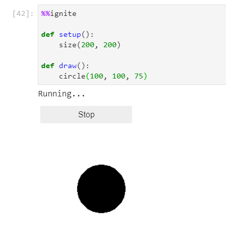

#### fill_circle()
```python
fill_circle(x, y, d)
```

**Parameters**

- x: (int or float) The value of the x position of the rectangle
- y: (int or float) The value of the y position of the rectangle
- d: (int or float) The diameter of the circle

Example(s):

*Creating a filled circle at (100, 100) with a diameter of 75*


```python hl_lines="7"
%%ignite

def setup():
    size(200, 200)

def draw():
    fill_circle(100, 100, 75)
```

Results in:

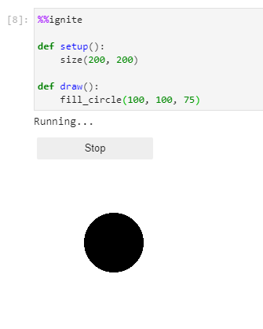


#### stroke_circle()
```python
stroke_circle(x, y, d)
```

**Parameters**

- x: (int or float) The value of the x position of the rectangle
- y: (int or float) The value of the y position of the rectangle
- d: (int or float) The diameter of the circle

Example(s):

*Creating a sroked circle at (100, 100) with a diameter of 75*


```python hl_lines="7"
%%ignite

def setup():
    size(200, 200)

def draw():
    stroke_circle(100, 100, 75)
```

Results in:

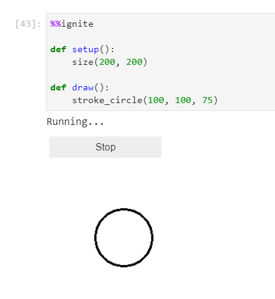

### Ellipses

To create an ellipse there are 3 options:

| Function                                      | Description                                          |
|-----------------------------------------------|------------------------------------------------------|
| [ellipse(x, y, l, w)](#ellipse)               | Draw an ellipse filled with color, and with a stroke |
| [fill_ellipse(x, y, l, w)](#fill_ellipse)     | Draw an ellipse filled with a color                  |
| [stroke_ellipse(x, y, l, w)](#stroke_ellipse) | Draw the outline of an ellipse (it's stroke)         |

<figure>
  
  <figcaption>Comparison of 3 functions, note the red color was added for visibility, by default fill is black</figcaption>
</figure>

#### ellipse()
```python
ellipse(x, y, l, w)
```

**Parameters**

- x: (int or float) The value of the x position of the rectangle
- y: (int or float) The value of the y position of the rectangle
- l: (int or float) The length of the ellipse
- w: (int or float) The width of the ellipse

Example(s):

*Creating a filled and stroked ellipse at (100, 100) with a length of 100 and height of 75*


```python hl_lines="7"
%%ignite

def setup():
    size(200, 200)

def draw():
    ellipse(100, 100, 100, 75)
```

Results in:

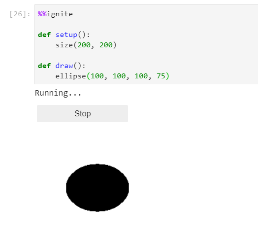

#### fill_ellipse()
```python
fill_ellipse(x, y, l, w)
```

**Parameters**

- x: (int or float) The value of the x position of the rectangle
- y: (int or float) The value of the y position of the rectangle
- l: (int or float) The length of the ellipse
- w: (int or float) The width of the ellipse

Example(s):

*Creating a filled ellipse at (100, 100) with a length of 100 and height of 75*


```python hl_lines="7"
%%ignite

def setup():
    size(200, 200)

def draw():
    fill_ellipse(100, 100, 100, 75)
```

Results in:

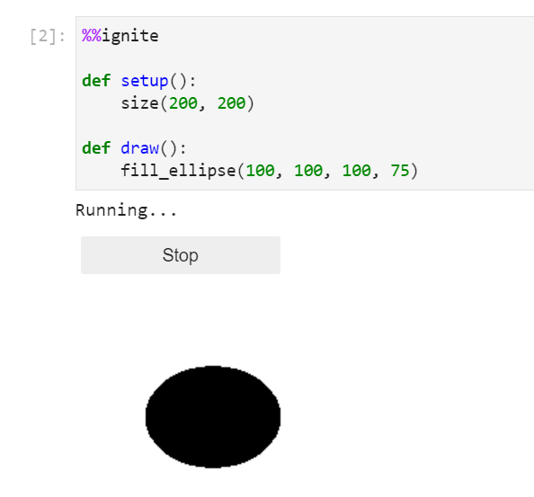

#### stroke_ellipse()
```python
stroke_ellipse(x, y, l, w)
```

**Parameters**

- x: (int or float) The value of the x position of the rectangle
- y: (int or float) The value of the y position of the rectangle
- l: (int or float) The length of the ellipse
- w: (int or float) The width of the ellipse

Example(s):

*Creating a filled ellipse at (100, 100) with a length of 100 and height of 75*


```python hl_lines="7"
%%ignite

def setup():
    size(200, 200)

def draw():
    stroke_ellipse(100, 100, 100, 75)
```

Results in:


### Triangles

To create a triangle there are 3 options:

| Function                                                    | Description                                          |
|-------------------------------------------------------------|------------------------------------------------------|
| [traingle(x1, y1, x2, y2, x3, y3)](#triangle)               | Draw a triangle filled with color, and with a stroke |
| [fill_triangle(x1, y1, x2, y2, x3, y3)](#fill_triangle)     | Draw a triangle filled with a color                  |
| [stroke_triangle(x1, y1, x2, y2, x3, y3)](#stroke_triangle) | Draw the outline of a trianlge (it's stroke)         |

<figure>
  
  <figcaption>Comparison of 3 functions, note the red color was added for visibility, by default fill is black</figcaption>
</figure>

#### triangle()

```python
triangle(x1, y1, x2, y2, x3, y3)
```

**Parameters**

- x1: (int or float) The value of the x position first of the three points
- y1: (int or float) The value of the y position first of the three points
- x2: (int or float) The value of the x position second of the three points
- y2: (int or float) The value of the y position second of the three points
- x3: (int or float) The value of the x position last of the three points
- y3: (int or float) The value of the y position last of the three points

Example(s):

*Creating a triangle with points at (110, 75), (75, 150), (150, 150)*


```python hl_lines="7"
%%ignite

def setup():
    size(200, 200)

def draw():
    triangle(110, 75, 75, 150, 150, 150)
```

Results in:

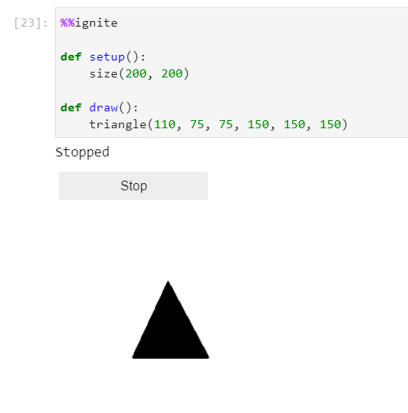

#### fill_triangle()

```python
fill_triangle(x1, y1, x2, y2, x3, y3)
```

**Parameters**

- x1: (int or float) The value of the x position first of the three points
- y1: (int or float) The value of the y position first of the three points
- x2: (int or float) The value of the x position second of the three points
- y2: (int or float) The value of the y position second of the three points
- x3: (int or float) The value of the x position last of the three points
- y3: (int or float) The value of the y position last of the three points

Example(s):

*Creating a filled triangle with points at (110, 75), (75, 150), (150, 150)*


```python hl_lines="7"
%%ignite

def setup():
    size(200, 200)

def draw():
    fill_triangle(110, 75, 75, 150, 150, 150)
```

Results in:

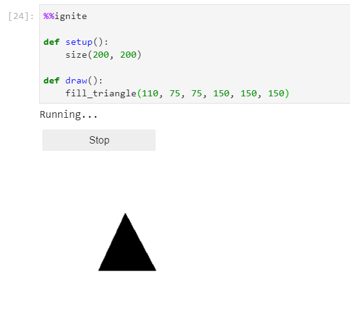

#### stroke_triangle()
```python
stroke_triangle(x1, y1, x2, y2, x3, y3)
```

**Parameters**

- x1: (int or float) The value of the x position first of the three points
- y1: (int or float) The value of the y position first of the three points
- x2: (int or float) The value of the x position second of the three points
- y2: (int or float) The value of the y position second of the three points
- x3: (int or float) The value of the x position last of the three points
- y3: (int or float) The value of the y position last of the three points

Example(s):

*Creating a stroked triangle with points at (110, 75), (75, 150), (150, 150)*


```python hl_lines="7"
%%ignite

def setup():
    size(200, 200)

def draw():
    stroke_triangle(110, 75, 75, 150, 150, 150)
```

Results in:

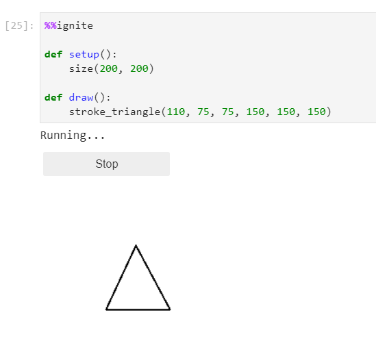


### Text

To create text in your drawing use:

```python
text(message, x, y)
```

**Parameters**

- message: (str) The text you want to draw
- x: (int or float) The value of the x position of the text
- y: (int or float) The value of the y position of the text


Example(s):

*Creating some text at (100, 100)*


```python hl_lines="7"
%%ignite

def setup():
    size(200, 200)

def draw():
    text("Hello World!", 100, 100)
```

Results in:


#### Change text size

To change the size of your text use:

```python
text_size(s)
```

**Parameters**

- s: (int or float) The size you want to make your text


Example(s):

*Creating some text at (100, 100), that is 16pt font*


```python hl_lines="7"
%%ignite

def setup():
    size(200, 200)

def draw():
    text_size(16)
    text("Hello World!", 100, 100)
```

Results in:

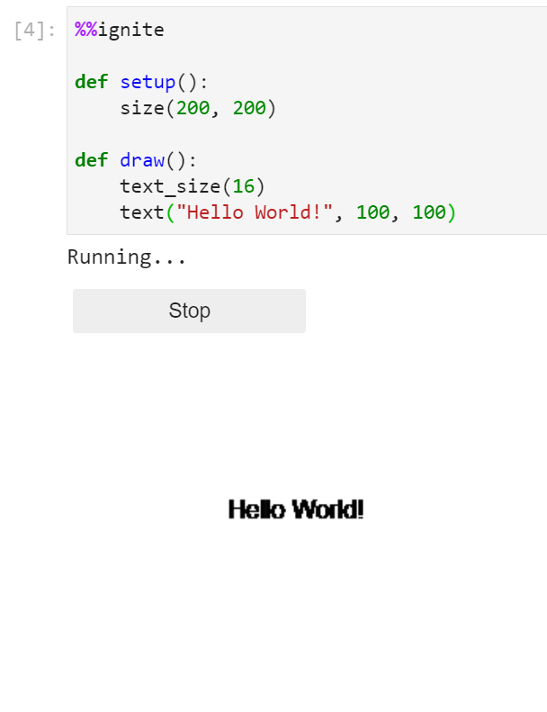
