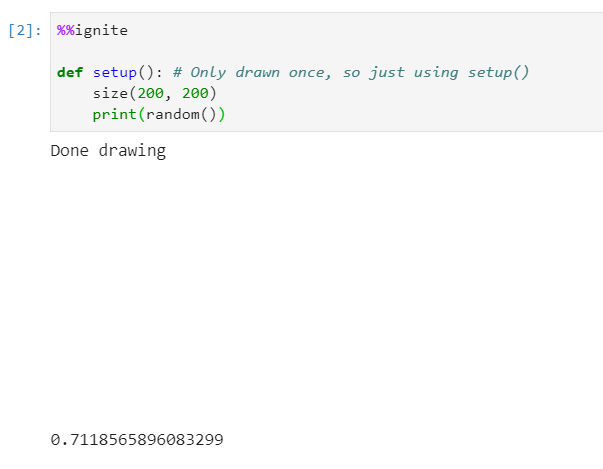
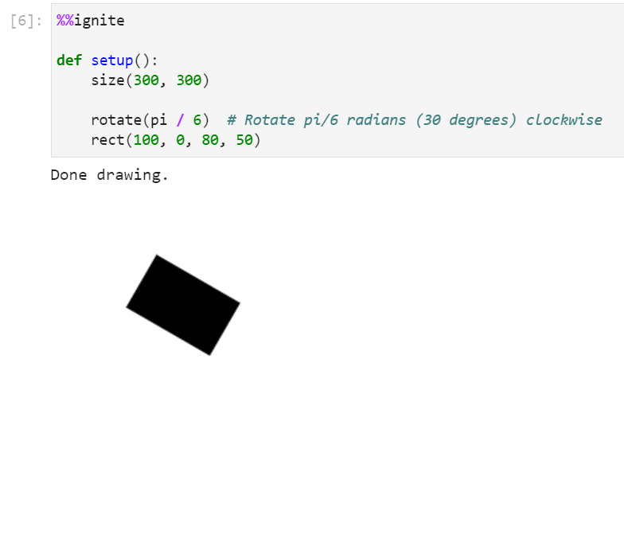

*Below is a list of all of some other helpful functions available within spark.*

All of the examples below assume you have the boilerplate from [the notebook setup](../#boilerplate) in your code

### Create a random float between 0 and 1

To generate a random float between 0 and 1 use:

```python
random()
```

**Example(s):**

*Printing a random value between 0-1*

```python hl_lines="5"
%%ignite

def setup():
    size(200, 200)
    print(random())
```

Results in:




### Create a random int

To generate a random integer between 0 and n (inclusive) use:

```python
randint(n)
```

**Parameters**

- n: (int) The highest value in the range

**Example(s):**

*Printing a random value between 0-10*

```python hl_lines="5"
%%ignite

def setup():
    size(200, 200)
    print(randint(10))
```

Results in:


### Rotation


Transformations are always done to the **canvas**, not the individual shapes themselves. Rotation is done around the origin, point (0, 0) and affects all shapes drawn afterwards. You can use our built-in `pi` variable to express radians, or convert from degrees to radians by multiplying your number of degrees by `pi / 180`.

Note that canvas transformations are not removed automatically. In other words, if you want to rotate just one shape in your `draw()` function, you should rotate the canvas by `r` radians, draw your shape, and then rotate by `-r` radians to undo the effect.

To rotate the canvas clockwise around the origin, use:

```python
rotate(r)
```

**Parameters**

- r: (float) The angle, in radians to rotate the canvas

**Example(s):**

*Rotating a rectangle by 30 degrees clockwise*

```python hl_lines="6"
%%ignite

def setup():
    size(300, 300)

    rotate(pi / 6)  # Rotate pi/6 radians (30 degrees) clockwise
    rect(100, 0, 80, 50)
```

Results in:

