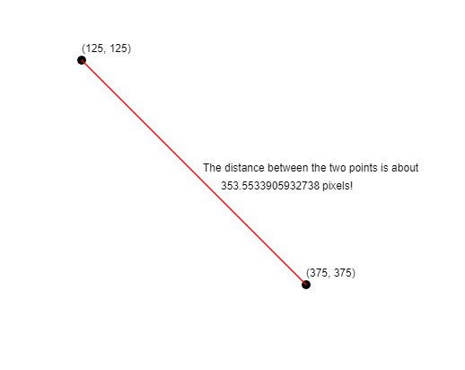
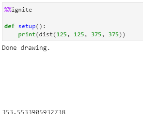
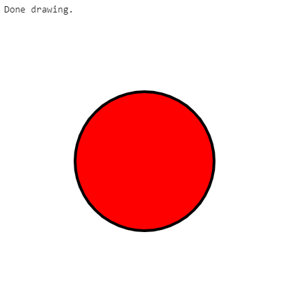
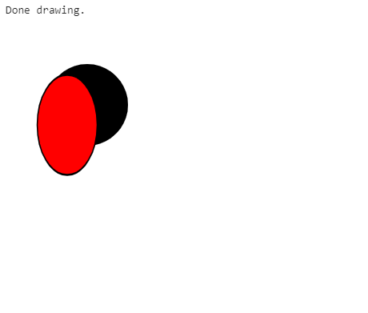
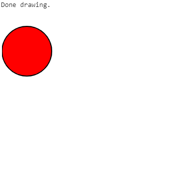

*Below is a list of all of some other helpful functions available within spark.*

All of the examples below assume you have the boilerplate from [the notebook setup](../#boilerplate) in your code

### Create a random float between 0 and 1

To generate a random float between 0 and 1 use:

```python
random()
```

**Example(s):**

*Printing a random value between 0-1*

```python hl_lines="5"
%%ignite

def setup():
    size(200, 200)
    print(random())
```

Results in:


### Create a random int

To generate a random integer between 0 and n (inclusive) use:

```python
randint(n)
```

**Parameters**

- n: (int) The highest value in the range

**Example(s):**

*Printing a random value between 0-10*

```python hl_lines="5"
%%ignite

def setup():
    size(200, 200)
    print(randint(10))
```

Results in:


### Rotation


Transformations are always done to the **canvas**, not the individual shapes themselves. Rotation is done around the origin, point (0, 0) and affects all shapes drawn afterwards. You can use our built-in `pi` variable to express radians, or convert from degrees to radians by multiplying your number of degrees by `pi / 180`.

Note that canvas transformations are not removed automatically. In other words, if you want to rotate just one shape in your `draw()` function, you should rotate the canvas by `r` radians, draw your shape, and then rotate by `-r` radians to undo the effect.

To rotate the canvas clockwise around the origin, use:

```python
rotate(r)
```

**Parameters**

- r: (float) The angle, in radians to rotate the canvas

**Example(s):**

*Rotating a rectangle by 30 degrees clockwise*

```python hl_lines="6"
%%ignite

def setup():
    size(300, 300)

    rotate(pi / 6)  # Rotate pi/6 radians (30 degrees) clockwise
    rect(100, 0, 80, 50)
```

Results in:


### Distance between two points (x1, y1) and (x2, y2)



To find the distance between two points (x1, y1) and (x2, y2), use the following command:

```python
dist(x1, y1, x2, y2)
```

**Parameters**

- x1: (float) The x-coordinate of the first point
- y1: (float) The y-coordinate of the first point
- x2: (float) The x-coordinate of the second point
- y2: (float) The y-coordinate of the second point

**Example(s):**

*Print the distance between (125, 125) and (375, 375)*

```python hl_lines="6"
%%ignite

def setup():
    print(dist(125, 125, 375, 375))
```

Results in:



### Scale (one parameter)

Scales the canvas units by x horizontally and vertically. 

Usage:

```python
scale(x)
```
**Parameters**

- x: (float) The factor by which the canvas is scaled.

**Example(s):**

*Scale horizontal and vertical canvas units by a factor of 2*

```python hl_lines="6"
%%ignite
def setup():
    size(400, 400)
    circle(100, 100, 100)
    fill_style("red")
    
    # apply scale of 2, this will scale canvas units by factor of 2 horizontally and vertically
    scale(2)
    circle(100, 100, 100)
```

Results in:



### Scale (two parameters)

Scales the canvas units by x horizontally and by y vertically. 

Usage:

```python
scale(x,y)
```
**Parameters**

- x: (float) The factor by which the canvas is scaled horizontally.
- y: (float) The factor by which the canvas is scaled vertically.

**Example(s):**

*Scale horizontal and vertical canvas units by factors of 0.75 and 1.25 respectively*

```python hl_lines="6"
%%ignite
def setup():
    size(400, 400)
    circle(100, 100, 100)
    fill_style("red")
    
    # apply scale of (0.75, 1.25), this will scale canvas units by factor of 0.75 horizontally and 1.25 vertically
    scale(0.75, 1.25)
    circle(100, 100, 100)
```

Results in:



### Translate

Moves the canvas and its origin on the grid. x indicates the horizontal distance to move, and y indicates vertical distance to move.

Usage:

```python
translate(x,y)
```
**Parameters**

- x: (float) The horizontal distance to translate the canvas.
- y: (float) The vertical distance to translate the canvas.

**Example(s):**

*Translate the canvas 50 units right and 75 units down*

```python hl_lines="6"
%%ignite
def setup():
    size(400, 400)
    circle(100, 100, 100)
    fill_style("red")
    
    # move canvas 50 units right, and 75 units down
    translate(50, 75)
    circle(100, 100, 100)
```

Results in:


