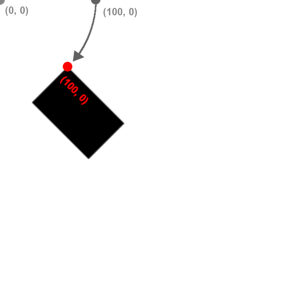
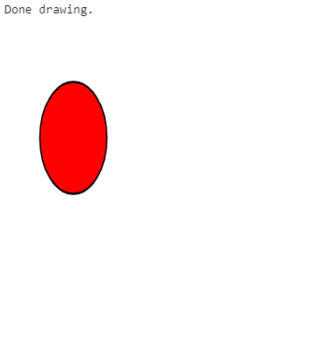

*Below is a list of all of some other helpful functions available within spark.*

All of the examples below assume you have the boilerplate from [the notebook setup](../#boilerplate) in your code

### Create a random float between 0 and 1

To generate a random float between 0 and 1 use:

```python
random()
```

**Example(s):**

*Printing a random value between 0-1*

```python hl_lines="5"
%%ignite

def setup():
    size(200, 200)
    print(random())
```

Results in:


### Create a random int

To generate a random integer between 0 and n (inclusive) use:

```python
randint(n)
```

**Parameters**

- n: (int) The highest value in the range

**Example(s):**

*Printing a random value between 0-10*

```python hl_lines="5"
%%ignite

def setup():
    size(200, 200)
    print(randint(10))
```

Results in:


### Distance between two points (x1, y1) and (x2, y2)


To find the distance between two points (x1, y1) and (x2, y2), use the following command:

```python
dist(x1, y1, x2, y2)
```

**Parameters**

- x1: (float) The x-coordinate of the first point
- y1: (float) The y-coordinate of the first point
- x2: (float) The x-coordinate of the second point
- y2: (float) The y-coordinate of the second point

**Example(s):**

*Print the distance between (125, 125) and (375, 375)*

```python hl_lines="4"
%%ignite

def setup():
    print(dist(125, 125, 375, 375))
```

Results in:


### Translate

Change the origin of the canvas.

Usage:

```python
translate(x, y)
```
**Parameters**

- x: (float) The horizontal distance to translate the canvas.
- y: (float) The vertical distance to translate the canvas.

**Example(s):**

*Translate the canvas 50 units right and 75 units down*

```python hl_lines="8"
%%ignite

def setup():
    size(400, 400)
    fill_style("red")
    
    # move canvas 50 units right, and 75 units down
    translate(50, 75)
    circle(0, 0, 100)
```

Results in:


### Rotation



Transformations are always done to the **canvas**, not the individual shapes themselves. Rotation is done around the origin, point (0, 0) and affects all shapes drawn afterwards. You can use our built-in `pi` variable to express radians, or convert from degrees to radians by multiplying your number of degrees by `pi / 180`.

Note that canvas transformations are not removed automatically. In other words, if you want to rotate just one shape in your `draw()` function, you should rotate the canvas by `r` radians, draw your shape, and then rotate by `-r` radians to undo the effect. Also note that you can rotate on a point other than the origin by first calling `translate` to change the origin to the new point.

To rotate the canvas clockwise around the origin, use:

```python
rotate(r)
```

**Parameters**

- r: (float) The angle, in radians to rotate the canvas

**Example(s):**

*Rotating a rectangle by 30 degrees clockwise*

```python hl_lines="6"
%%ignite

def setup():
    size(300, 300)

    rotate(pi / 6)  # Rotate pi/6 radians (30 degrees) clockwise
    rect(100, 0, 80, 50)
```

Results in:


### Scale

Scales the canvas. Note that scaling applies to the canvas, not to individual shapes. You can scale on a point other than the origin by first calling `translate` to change the origin to the new point.

There are two ways to use scale:

| Method                           | Description                                                                  | Syntax          |
| -------------------------------- | -----------------------------------------------------------------------------|-----------------|
|[1 float](#scale-with-one-float)  | Scale canvas width and height by some amount, i.e. 1.5                       | scale(1.5)      |
|[2 floats](#scale-with-two-floats)| Scale canvas width by first number and height by second number, i.e. 2.5, 3.5| scale(2.5, 3.5) |

#### Scale with one float

```python
scale(n)
```
**Parameters**

- n: (float) The amount to scale the height and width of the canvas.

**Example(s):**

*Double height and width of canvas using scale*

```python hl_lines="8"
%%ignite

def setup():
    size(400, 400)
    fill_style("red")
    
    # apply scale of 2, this will scale canvas units by factor of 2 horizontally and vertically
    scale(2)
    circle(100, 100, 100)
```

Results in:


#### Scale with two floats

```python
scale(x, y)
```
**Parameters**

- x: (float) The amount to scale the width of the canvas.
- y: (float) The amount to scale the height of the canvas.

**Example(s):**

*Scale canvas width by 0.75 and canvas height by 1.25*

```python hl_lines="8"
%%ignite

def setup():
    size(400, 400)
    fill_style("red")
    
    # apply scale of (0.75, 1.25), this will scale canvas units by factor of 0.75 horizontally and 1.25 vertically
    scale(0.75, 1.25)
    circle(100, 100, 100)
```

Results in:



### Accessing the canvas frame rate

The frame rate of the canvas can be accessed through the built-in variable

```python
FRAME_RATE
```

The value of FRAME_RATE is set to 30 by default, and should not be changed by the user. Changing this manually will not change the actual frame rate, and will likely result in errors.

**Example:**

```python
%%ignite

def setup():
    print(FRAME_RATE)
```

Results in:


The use-cases of this of this variable are fairly limited, but can be used for example to set a speed variable in terms of the frame rate. For example:

```python
x = 10
speed = 300/FRAME_RATE

def draw():
    global x, speed
    circle(x, 100, 50)
    x += speed
```
will result in the circle moving across the screen at 300 pixels per second.


